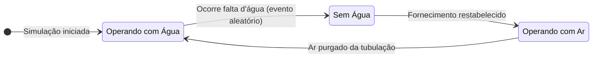

# Simulador de Hidrômetro Analógico
## SHA-2.0
   

> Software para simular o funcionamento de um medidor de água analógico. O propósito principal é fornecer uma interface visual e uma API REST para que outros softwares possam consumir dados de medição sem depender de um hardware real.

Este projeto foi desenvolvido como uma solução robusta para simular as diversas condições de operação de um hidrômetro, incluindo fluxo normal, falta de água e passagem de ar.


## ✨ Funcionalidades

* **Interface Gráfica Realista:** Uma UI construída com JavaFX que simula visualmente um hidrômetro, com ponteiros animados e um contador digital.
* **Simulação de Estados:** O comportamento do hidrômetro muda dinamicamente para refletir diferentes condições:
    * `EstadoComAgua`: Fluxo de água normal, registrando consumo.
    * `EstadoSemAgua`: Interrupção no fornecimento, sem consumo.
    * `EstadoComAr`: Passagem de ar pela tubulação, registrando consumo incorretamente (um cenário do mundo real).
* **Eventos Aleatórios:** A simulação inclui eventos estocásticos, como a chance de ocorrer uma "falta de água" para aumentar o realismo.
* **Flutuação de Pressão:** A pressão da água não é estática, mas flutua de forma realista em torno de um valor base, utilizando uma distribuição Gaussiana.
* **API REST para Integração:** Expõe os dados da simulação em tempo real através de endpoints REST, permitindo que sistemas externos monitorem o hidrômetro.

## 🛠️ Tecnologias Utilizadas

* **Linguagem:** Java 17
* **Build e Gerenciamento de Dependências:** Apache Maven
* **Interface Gráfica (GUI):** JavaFX
* **Servidor da API REST:** Javalin (um framework web leve para Java/Kotlin)

## 🏛️ Arquitetura

O projeto foi estruturado com base em princípios de design SOLID e padrões de projeto para garantir um código desacoplado, manutenível e extensível.

* **Padrão de Projeto State (Estado):** Utilizado para gerenciar o comportamento complexo do hidrômetro. Cada estado (`ComAgua`, `SemAgua`, `ComAr`) é encapsulado em sua própria classe, eliminando a necessidade de condicionais complexas e aderindo ao Princípio Aberto/Fechado.
* **Padrão de Projeto Observer (Observador):** Usado para desacoplar o modelo (`Hidrometro`) da visão (`Display`). O `Hidrometro` (o *Subject*) notifica o `Display` (o *Observer*) sobre qualquer mudança em seu estado, que então atualiza a interface gráfica sem que haja um acoplamento direto entre eles.

## 🚀 Como Executar o Projeto

### Pré-requisitos

* JDK 17 ou superior.
* Apache Maven 3.6 ou superior.
* Uma IDE Java, como o IntelliJ IDEA (recomendado).

### Passos para Execução

1.  **Clone o repositório:**
    ```bash
    git clone [https://github.com/seu-usuario/seu-repositorio.git](https://github.com/seu-usuario/seu-repositorio.git)
    ```
2.  **Abra no IntelliJ IDEA:**
    * Abra o IntelliJ e selecione `File > Open...`.
    * Navegue até a pasta do projeto clonado e a abra.
    * Aguarde o IntelliJ sincronizar e baixar todas as dependências do Maven (pode levar um minuto).

3.  **Execute a Aplicação:**
    * No canto direito da IDE, abra a aba vertical **Maven**.
    * Expanda as seções: `[nome-do-projeto] > Plugins > javafx`.
    * Dê um duplo clique no goal **`javafx:run`**.

    A aplicação JavaFX será iniciada, e o servidor da API começará a rodar na porta `7070`.

    ### Diagrama de Estados

O comportamento do hidrômetro é gerenciado por um Padrão de Projeto State. O diagrama a seguir ilustra os diferentes estados e as transições entre eles.



## 📡 Endpoints da API

A API REST fornece acesso em tempo real aos dados do simulador.

| Endpoint    | Método HTTP | Descrição                                    | Exemplo de Resposta JSON                                          |
|-------------|-------------|------------------------------------------------|-------------------------------------------------------------------|
| `/api/data` | `GET`       | Retorna os dados de medição primários.      | `{"consumoTotalM3":1200.123, "pressaoAtualKpa":345.6, "estado":"EstadoComAgua"}` |
| `/api/status` | `GET`       | Retorna o estado operacional atual.     | `{"consumoTotalM3":1200.123, "pressaoAtualKpa":345.6, "estado":"EstadoComAgua"}` |

## 📄 Licença

Este projeto está licenciado sob a Licença MIT.

---
Feito por ilaninha.
